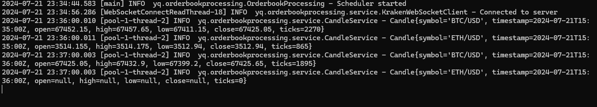

# OrderbookProcessing

## Prerequisites

Before you begin, ensure you have met the following requirements:

- Java 17 installed.
- Maven installed.

## Installation

To build and install the project, follow these steps:

1. Clone the repository:

    ```sh
    git clone https://github.com/your-username/OrderbookProcessing.git
    cd OrderbookProcessing
    ```

2. Build the project using Maven:

    ```sh
    mvn clean install
    ```

## Running the Application

After building the project, you can run the application using the generated JAR file.

### Step-by-Step

1. Navigate to the `target` directory:

    ```sh
    cd target
    ```

2. Run the JAR file:

    ```sh
    java -jar OrderbookProcessing-1.0-SNAPSHOT-jar-with-dependencies.jar
    ```

## Example Output


## Assumption Made
1. No candle output if no data within the 1 minute timeframe
2. Data timestamp are always in sequence

